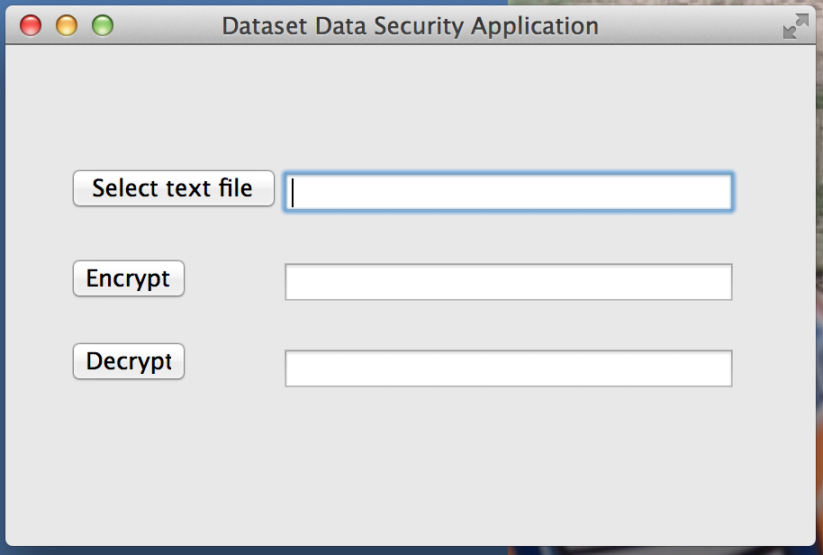

# Datasec Data Security Application

## Introduction

Datasec is a Java Desktop application which is built using [Eclipse Standard Widget Toolkit](https://www.eclipse.org/swt/)
and the [javax.crypto](http://docs.oracle.com/javase/7/docs/api/javax/crypto/package-summary.html) API for providing cryptographic operations.

When run, the application allows the user to upload text files from the local file system and provides Encryption and Decryption functionality.
Output files are then written back to the filesystem relatie to wherever the Datasec application was invoked. 

## Prerequisites

 * >= Java 1.6
 * [Apache Maven](http://maven.apache.org)
 * [Git](https://git-scm.com/)

## Download and Install

Datasec can be downloaded and installed as follows

```
git clone https://github.com/lewismc/datasec.git
cd datasec
mvn install
```
The above first clones the repository to your local machine, it then changes your terminal session to the 'datasec' directory, the final command uses Apache Maven to build the project.
You will see that this has created a 'target' directory containing your datasec application JAR. You can see this as follows
```
lmcgibbn@LMC-032857 ~/Documents/workspace/datasec(master) $ tree
.
├── Decrypted.txt
├── Encrypted.txt
├── LICENSE
├── dependency-reduced-pom.xml
├── pom.xml
├── src
│   ├── main
│   │   ├── java
│   │   │   └── org
│   │   │       └── graeme
│   │   │           └── datasec
│   │   │               ├── DatasecApp.java
│   │   │               └── package-info.java
│   │   └── resources
│   └── test
│       ├── java
│       └── resources
└── target
    ├── classes
    │   └── org
    │       └── graeme
    │           └── datasec
    │               ├── DatasecApp$1.class
    │               ├── DatasecApp$2.class
    │               ├── DatasecApp$3.class
    │               └── DatasecApp.class
    ├── datasec-0.0.1-SNAPSHOT.jar
    ├── maven-archiver
    │   └── pom.properties
    ├── maven-status
    │   └── maven-compiler-plugin
    │       ├── compile
    │       │   └── default-compile
    │       │       ├── createdFiles.lst
    │       │       └── inputFiles.lst
    │       └── testCompile
    │           └── default-testCompile
    │               └── inputFiles.lst
    ├── original-datasec-0.0.1-SNAPSHOT.jar
    └── test-classes

23 directories, 17 files
```
You can now run the application as follows
```
java -XstartOnFirstThread -jar target/datasec-0.0.1-SNAPSHOT.jar
```
This should start the application and you will see the following



## Application Features

From here you can then upload a text file of your choice from your local file system.
You can Enctypt and Decrypt the data contained within the file with the output being written to Encrypted.txt and Decrypted.txt respectively. 
The output files are written relative to wherever the application was run from. 


